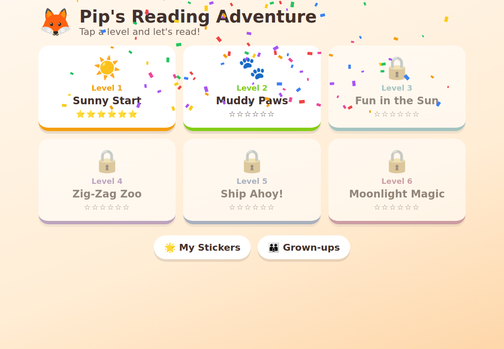

# 🦊 Pip's Reading Adventure

A fun, research-based phonics game that teaches 5‑year‑olds to read English
sentences — and eventually whole books. Built as a **Progressive Web App
(PWA)** so it installs on an iPad home screen like a native app and works
**fully offline** with audio.



## What's inside

| | |
|---|---|
| 🎬 **Sound Videos** | Animated, narrated lessons for every letter‑sound |
| 🧩 **Blend It!** | Tap sounds in order and push them together into words |
| 🔤 **Word Builder** | Build words from letter tiles to match a picture |
| ❤️ **Heart Words** | Tricky sight words (the, said, one…) learned by heart |
| 📖 **Read It!** | Read real decodable sentences + picture comprehension check |
| 📚 **My Book** | A decodable mini‑book at the end of every level |

Six levels, ~40 letter‑sounds and digraphs, 30 decodable sentences,
6 mini‑books, stars, stickers, confetti and Pip the fox. 🦊

## The research behind it

The game follows the **Science of Reading** — the evidence base (National
Reading Panel and decades of follow‑up research) showing children learn to
read best through **explicit, systematic synthetic phonics**:

- **Systematic GPC progression** modelled on the UK *Letters & Sounds*
  phases: `s a t p i n` first (they make many words quickly), then more
  single letters, then digraphs (`sh ch th ng qu`), then vowel teams and
  magic e (`ai ee oa oo, a‑e i‑e o‑e`).
- **Decodable text only**: every word a child is asked to read uses only
  the sounds already taught, plus explicitly taught "heart words". No
  guessing from pictures — real decoding.
- **Blending and segmenting** (the core of phonemic awareness) practised in
  every level.
- **Immediate corrective feedback**, mastery‑based unlocking, short
  sessions, and reward loops (stars/stickers) for motivation.
- **Bridge to books**: each level ends with a real decodable mini‑book —
  the on‑ramp to independent book reading.

A "Grown‑ups" section in the app (opened with a 3‑second hold, so little
fingers stay out) explains the approach and gives tips — most importantly,
that parents should echo **pure sounds** ("sss", not "suh") alongside the
app's synthesised voice.

## Install on an iPad

The app must be served over HTTPS. The easiest free way is **GitHub Pages**
(a deploy workflow is already included):

1. In this repository go to **Settings → Pages** and set
   **Source: GitHub Actions**. Merge/push this code to the `main` branch —
   the included workflow (`.github/workflows/pages.yml`) publishes the site
   automatically. Your game URL will be
   `https://<your-username>.github.io/<repo-name>/`.
2. On the iPad, open that URL in **Safari**.
3. Tap the **Share** button (square with arrow) → **Add to Home Screen** →
   **Add**.
4. Done! The game now launches full‑screen from its own icon and works
   completely offline (audio included — it uses the iPad's built‑in
   speech voices).

> Tip: the first time the game runs, tap "Let's play!" — iPads require one
> tap before audio is allowed to play.

## Run locally (for development)

No build step, no dependencies:

```bash
python3 -m http.server 8000
# open http://localhost:8000
```

Regenerate the app icons (pure Node, no packages needed):

```bash
node scripts/make-icons.mjs
```

## Project structure

```
index.html            App shell + iPad PWA meta tags
manifest.webmanifest  PWA manifest (name, icons, standalone display)
sw.js                 Service worker — precaches everything for offline use
css/style.css         Kid-friendly styles: big touch targets, animations
js/data.js            The curriculum: 6 stages of GPCs, words, sentences, books
js/audio.js           Speech synthesis + WebAudio sound effects
js/app.js             Screens, games, progress, rewards
scripts/make-icons.mjs  Generates the PNG icons with zero dependencies
```

Progress is stored in `localStorage` on the device. The "Grown‑ups" section
has a reset button.
